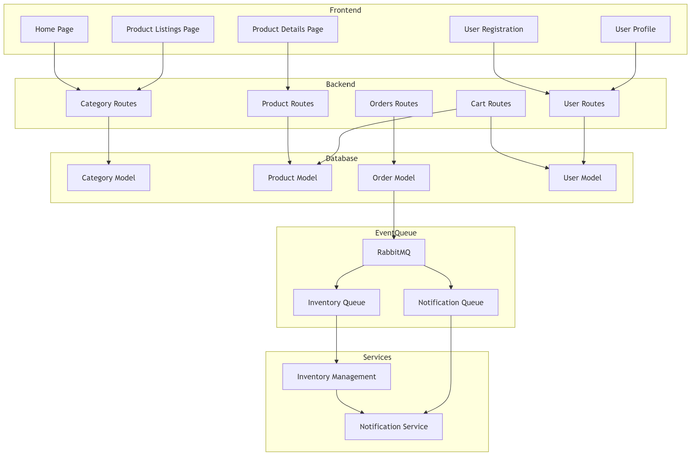

# Software Architecture Final Project - Layer Architecture Design  (Selected)

## Project Overview
The **PawPaw Market** is a web application designed to simplify the process of purchasing pet goods for pet owners. This project aims to simulate a web application for purchasing pet goods.

### Capabilities and Features

1. **Product Listings**  
   The application offers a catalog of over 100 different pet goods, allowing users to browse and select from various products such as food, toys, and more. Each product card contains detailed descriptions and prices of the product.

2. **Categorization**  
   Products are organized into categories, such as Dog Food, Bird Toys, etc., to help users quickly filter through the inventory and find items based on their pet's needs. These categories are available to select from the products dropdown.

3. **Shopping Cart**  
   Users can add items to their shopping cart as they browse. The cart keeps track of all selected items and provides a summary of the total purchase. Once users finalize their choices, they can place their order.

4. **User Profile**  
   Each user has a personalized profile where they can view their order history and see personal information. The profile allows users to track past purchases and view their account information.

### Operational Scenarios

1. **Browse**  
   Users can browse through the product catalog, use the provided categories to find items, and add selected items to their cart.

2. **View Profile**  
   The user profile feature allows customers to view their personal information and order history. Users can track their previous purchases and manage their account details to ensure up-to-date information.

3. **View Shopping Cart**  
   The shopping cart provides users with a clear overview of all selected items. It displays product details, quantities, and total costs. Users can modify the cart by adding, removing, or updating items before proceeding to checkout.

4. **Place Order**</br>
   After adding items to their shopping cart, users can place their order to purchase items.

## Layer Architecture (Oliver)
//just add diagram and related information if needed
## Event-based Architecture 



## Comparison between two architecture styles (Ben)
### Layered Architecture

#### Pros:
1. **Separation of Concerns**:  
   In a layered architecture, responsibilities are divided into layers (e.g., presentation, business logic, data access). This makes the system easier to understand and maintain. In the PawPaw Market, the UI layer can focus solely on user interactions, while the backend handles business logic and database queries. This made it easier to decide on where to handle specific functionality for our project.

2. **Maintainability**:  
   Layered systems are easier to maintain since changes to one layer typically do not impact other layers. When we changed the database schema (e.g., adding new product categories), only the data access layer needed to be updated, leaving the presentation layer intact.

3. **Testability**:  
   Each layer can be tested independently, making it easier to identify bugs and ensure the system operates correctly. For us, being able to do unit testing on individual components such as the shopping cart functionality was made easier because we did not need to test the database layer as well.
   
5. **Flexibility**:  
   The modularity of layers allows for swapping out implementations. For example, switching from a relational database to a NoSQL database only impacts the data access layer. This in particular was useful from when we switched from SQL to MongoDB.

#### Cons:
1. **Latency**:  
   Layered architectures introduce additional overhead due to communication between layers. In a real-time scenario like a product search in the Pet Marketplace, latency could slow down query results when selecting categories, negatively impacting user experience.

2. **Rigid Coupling**:  
   Layers can become rigidly tied to specific implementations. When we changed the database schema, we had to completely modify the data access layer to incorporate these changes.

3. **Overhead (Complexity)**:  
   Adding layers increases complexity. For smaller applications like our market, this overhead might outweigh the benefits. As a result, we had to spend a little bit of extra time understanding the interactions between layers.

4. **Real-Time Updates**:  
   Layered architecture struggles with real-time updates due to its sequential data flow. If there were ever a point where we needed to update something in real-time after deployment, it would be cumbersome to implement.

---

### Event-Based Architecture

#### Pros:
1. **Real-Time Updates**:  
   Event-based architectures excel in scenarios requiring real-time feedback. As such, after deployment, if any real-time updates need to be made, such as quantity of inventory, the user can be notified easily if the item is running low or is out of stock.

2. **Loose Coupling**:  
   Components in an event-based architecture communicate through events rather than direct calls, making them independent. For instance, the "Checkout" feature could trigger an event to update inventory without needing to directly interact with the inventory system, allowing for flexibility in adding new features.

3. **Asynchronous Processing**:  
   Long-running tasks like order fulfillment or payment processing can run in the background, ensuring the system remains responsive. This means that users can continue shopping while their orders are being processed.

4. **Fault Tolerance**:  
   Event-based architectures can recover from failures. If the notification service in the PawPaw Market fails temporarily, it can retry sending alerts without affecting the rest of the system.

#### Cons:
1. **Complexity**:  
   Event-driven systems require additional infrastructure (We use RabbitMQ), which increases setup and maintenance costs. For something like PawPaw Market, this adds complexity to the entire application.

2. **Latency in Event Delivery**:  
   While asynchronous processing is beneficial, it can lead to delays in critical workflows. For example, if inventory updates are delayed due to event queuing, users might purchase out-of-stock items.

3. **Debugging**:  
   Tracing issues in event-based systems is challenging because of distributed components. Debugging why an order confirmation email wasn't sent might involve examining logs from multiple services (event producer, message broker, and consumer).

4. **Consistency**:  
   Eventual consistency can cause temporary discrepancies in data. In the Pet Marketplace, a user might see outdated stock information or incorrect order statuses if updates are delayed, leading to user frustration.

## Rationale on final decision
For the PawPaw Marketplace project, layered architecture emerges as the most practical solution due to its simplicity and ability to meet the project's immediate requirements. This approach structures the application into distinct layers, including presentation, business logic, and data access, promoting a clean separation of concerns. This design not only facilitates easier development and testing but also simplifies ongoing maintenance.The project's current scope revolves around essential features such as product browsing, cart management, and order processing. These functionalities do not demand the complexity of real-time updates or the scalability of more intricate systems. By opting for layered architecture, the team benefits from a streamlined implementation process with minimal overhead, ensuring faster delivery. Furthermore, this architecture provides enough flexibility to accommodate future upgrades without significant rework. In conclusion, layered architecture offers more balance of efficiency, clarity, and scalability for this stage of development of the PawPaw Marketplace.

## How to compile and excute the code (Tran)
### Prerequisites:
- Install Node.js and npm or yarn (latest version recommended).
- Install a code editor like VS Code (optional but recommended).

### Add `.env` file to connect with the MongoDB.
- Ensure MongoDB is properly configured and running (please refer to the .env file submitted on canvas for security). Add `.env` file to `backend\` directory.

### Backend Setup (Express.js)
Navigate to the backend directory:
```
cd backend
```
Install dependencies:
```
npm install
```
Or, if you use Yarn:
```
yarn install
```
Run the server:
```
npm run dev
```
Or:
```
yarn run dev
```
The server will start on the port specified in server.js (default is usually http://localhost:8000).

### Frontend Setup (React)
Navigate to the React directory:
```
cd bootstrap-with-react
```
Install dependencies:
```
npm install
```
Or:
```
yarn install
```
Start the React app:
```
npm start
```
Or:
```
yarn start
```
The React app will start on the default port http://localhost:3000.
